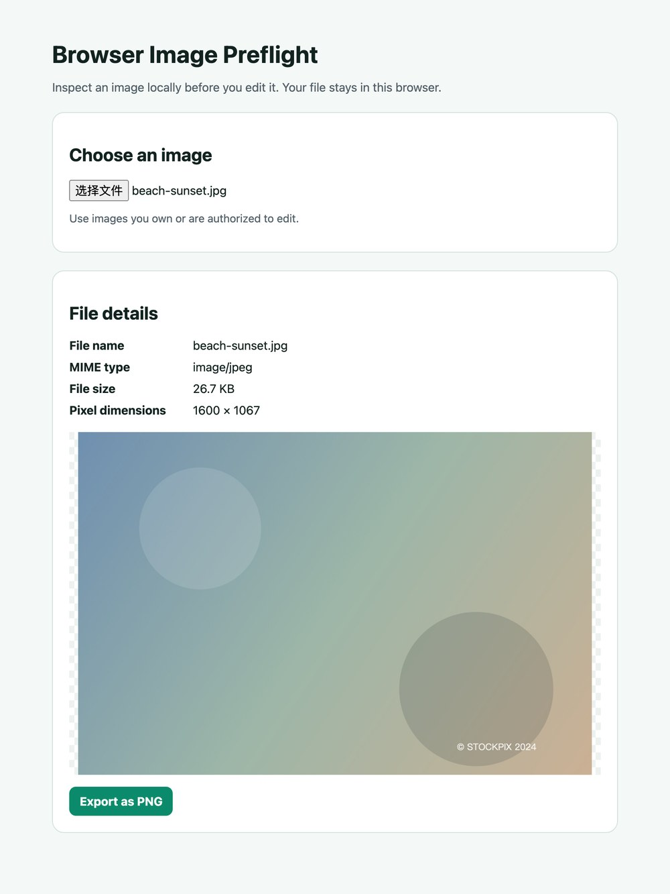

# Browser Image Preflight

Browser Image Preflight is a small companion utility for the browser-based watermark-removal workflow at [MarkVanish](https://markvanish.com/). It helps a visitor inspect an image before editing: file type, file size, pixel dimensions, and a local preview are shown before any export.

No image is uploaded by this utility. It runs entirely in the browser and can export the selected image as PNG.

## Run it

Download `image-preflight.html` and open it in any modern browser. There is no build step and no server to configure.

## Useful checks before editing an image

- Confirm that the file is the intended one and inspect its dimensions.
- Keep a copy of the original before exporting a new PNG.
- Make sure you have the right to edit the image and remove any marks or overlays.

## What has been checked

| Check | Method | Result |
|:--|:--|:--|
| The utility never uploads | Inspect the single inline script for `fetch(`, `XMLHttpRequest`, `FormData`, `sendBeacon`, `WebSocket`, `EventSource` | None present. Selection, preview and export all go through `URL.createObjectURL` and `canvas.toBlob` |
| Layout at 390 CSS px | Load the page in a 390 px frame and compare `scrollWidth` against the viewport, looking for clipped elements | No horizontal overflow, nothing clipped; the details grid collapses to a single column |
| Export path | Execute the page script against a stubbed DOM, in both a normal and a failure case | A valid canvas downloads once as `image/png` and reports the exported dimensions; a null blob reports the failure instead of downloading an empty file |

The third row is a stubbed-DOM test, not a browser download. It covers the branch logic; it does not prove that a given browser writes the file to disk.

One limit worth knowing: the reported pixel dimensions come from the browser's own decoder. There is no bundled WASM decoder, so a format the browser cannot decode will not preview or export here. That is deliberate — the alternative is a server-side converter, which would mean uploading the file.

## Files

- `image-preflight.html` — local, reusable inspection and PNG-export tool.
- `browser-image-workflow-checklist.csv` — a compact review checklist for browser-based image tools.
- `watermark-removal-review-checklist.md` — a plain-language checklist for checking an editing workflow before publishing it.
- `docs/images/` — screenshot of the tool with a file loaded.

## License

MIT. See [LICENSE](LICENSE).
